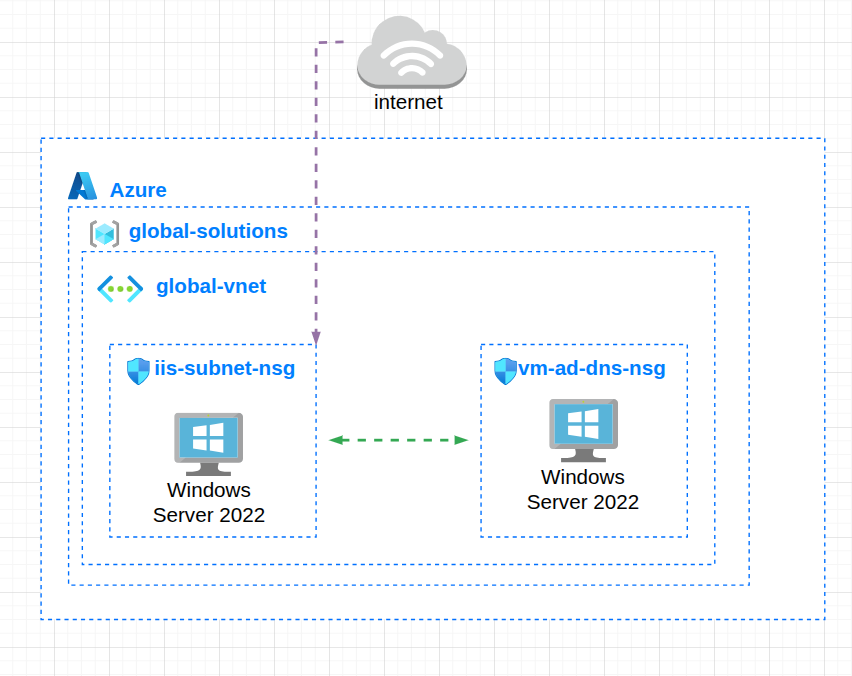
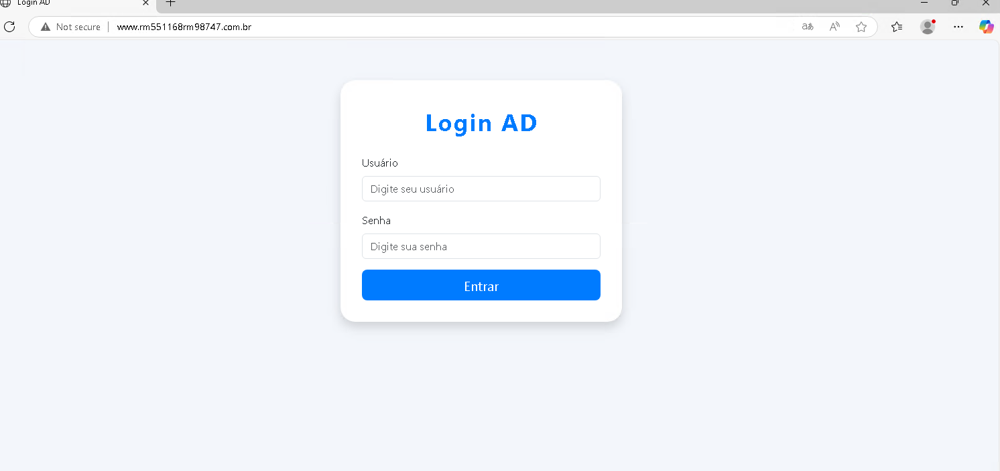
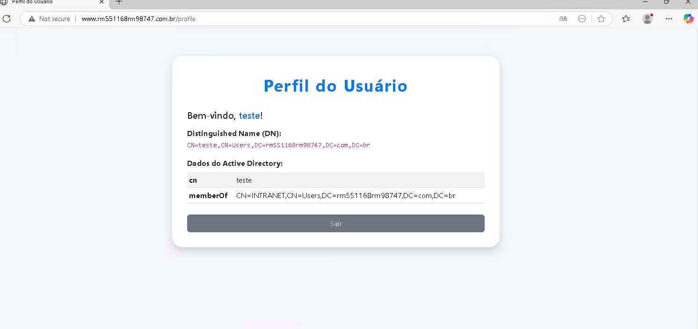

# Projeto: Infraestrutura Resiliente e Autenticação com Alta Disponibilidade no Azure

## 👥 Integrantes

- Laura Claro Mathias – RM98747
- Guilherme Silva Dos Santos – RM551168
  
## Objetivo do Desafio

Este projeto recria, do zero, toda a infraestrutura de servidores e autenticação, com alta disponibilidade e resiliência para suportar falhas como falta de energia, garantindo:

- Usuários autenticando via sistema web conectado ao Active Directory (AD).
- Infraestrutura pronta para falhas regionais (redundância e backups automáticos).
- Tudo baseado em máquinas virtuais Azure.
- Pesquisa de soluções, resiliência e documentação detalhada.

---

## 1. Configuração da Infraestrutura no Azure

- **Rede Virtual (VNet):** Criada com sub-redes separadas para:
  - **Controlador de Domínio/AD**
  - **Servidor Web (IIS)**
  - **Servidor DNS**

- **Máquinas Virtuais:**
  - **VM 1:** Windows Server 2022 — Controlador de Domínio + DNS
  - **VM 2:** Windows Server 2022 — IIS + Aplicação Flask (Python)

- **NSGs (Network Security Groups):**
  - Regras para liberar RDP (porta 3389), HTTP (porta 80) e LDAP/LDAPS.

**Exemplo de Diagrama da Arquitetura:**



---

## 2. Serviços Instalados e Configurados

- **DNS:**
  - Zona direta e reversa para o domínio.
  - Hosts A e CNAME conforme requisito.
  - DNS Secundário configurado para redundância.

- **Active Directory:**
  - Grupos e usuários criados.
  - Políticas de senha e OU conforme boas práticas.

- **IIS:**
  - Página de status publicada.
  - Reverse proxy para backend Flask rodando via FastCGI.

**Exemplo de configuração de hosts DNS:**
- `www.rm551168rm98747.com.br` (A — aponta para IP da VM IIS)
- `online.rm551168rm98747.com.br` (CNAME — alias para www)
- `intranet.rm551168rm98747.com.br` (CNAME — alias para www)

---

## 3. Sistema Web de Autenticação

- **Backend Python (Flask):**
  - Autentica usuários do AD via LDAP.
  - Exibe nome e grupos do usuário autenticado.
  - Logs locais com data/hora de cada login.
- **Hospedagem:**  
  - Publicado via FastCGI no IIS para integração nativa Windows.
- **Evidência:**  
  
  

---

## Vídeo explicativo

[Assista aqui](https://youtu.be/VXgpDZnpn9k?si=GEHqtWvaFcO-uzuj)

## 4. Alta Disponibilidade e Recuperação de Falhas

### a) **Snapshots e Backups**
- Configurado **Recovery Services Vault** para backups automáticos das VMs.

### b) **Simulação de Falha Regional**
- Desligamento/simulação de perda da VM principal.
- Restauração rápida em nova região.

### c) **Política de Failover Manual**
```markdown
1. Detectar falha da VM/região principal.
2. Acessar o Recovery Vault no Azure.
3. Restaurar a VM a partir do snapshot/backup em outra região.
4. Validar a disponibilidade dos serviços (AD/IIS).
5. Atualizar DNS e informar equipe/usuários.
6. Meta: recuperação em até 10 minutos.
```

## Passos do Failover Manual

1. **Detecção de Falha**
    - Monitorar continuamente os serviços críticos.
    - Confirmar a indisponibilidade total ou parcial da região primária.

2. **Acesso ao Recovery Services Vault**
    - No Portal Azure, acessar o Recovery Vault configurado para os backups das VMs.

3. **Restaurar VM em Outra Região**
    - Selecionar a VM afetada.
    - Clicar em `Restore VM`.
    - Selecione a região secundária disponível.
    - Preencher as configurações de nome, resource group e rede virtual para a nova VM.

4. **Validação dos Serviços**
    - Após restauração, acessar a nova VM e validar que os serviços (AD, IIS, etc.) estão funcionando.

5. **Atualização de DNS/IP**
    - Atualizar entradas DNS para o novo IP da VM restaurada.

6. **Comunicação**
    - Notificar equipe e usuários sobre a mudança para o ambiente de contingência.

### Fluxo Resumido

| Etapa                        | Responsável         | Tempo estimado |
|------------------------------|---------------------|---------------|
| Detecção da falha            | Operador NOC/TI     | 1 min         |
| Acesso ao Recovery Vault     | Administrador Azure | 1 min         |
| Início do Restore VM         | Administrador Azure | 2 min         |
| Validação dos Serviços       | Suporte Técnico     | 4 min         |
| Atualização de DNS           | Técnico de Rede     | 2 min         |
| **Total estimado**           |                     | **10 min**    |


## 2. Teste de Recuperação — Disaster Recovery Test

### Procedimento Executado

1. **Simulação de Queda**
    - A VM original foi desligada para simular falha regional.

2. **Restore**
    - No Recovery Vault, foi restaurado o backup mais recente para uma nova VM, em outra região.

3. **Validação**
    - O acesso à nova VM foi validado, comprovando o funcionamento dos serviços.

4. **Tempo de Recuperação**
    - Todo o procedimento levou **X minutos** (preencher após teste real).

5. **Evidências**
    - Prints de tela e logs do procedimento foram salvos para comprovação. 


